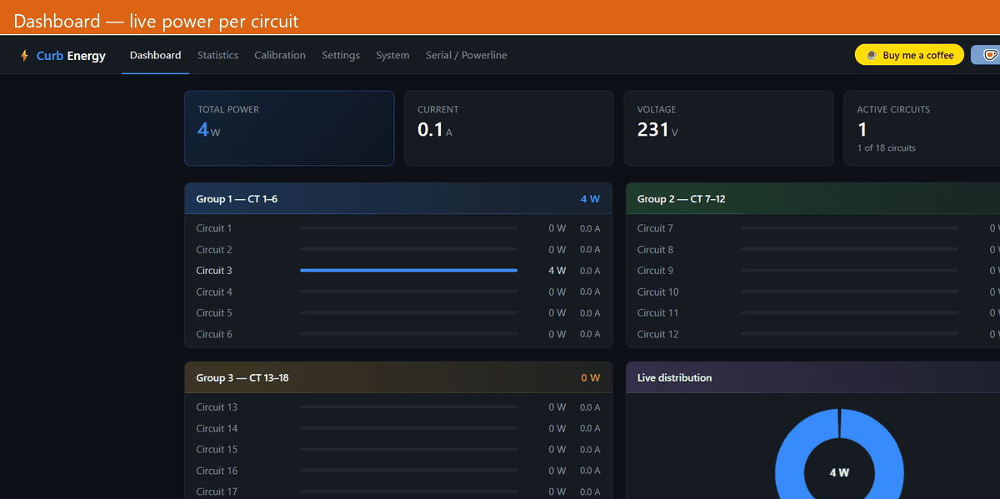
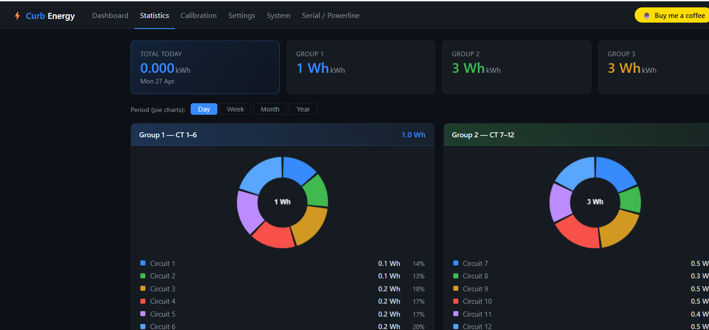
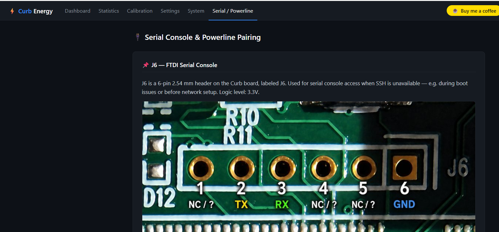
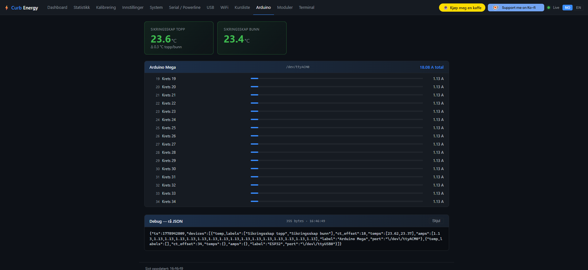
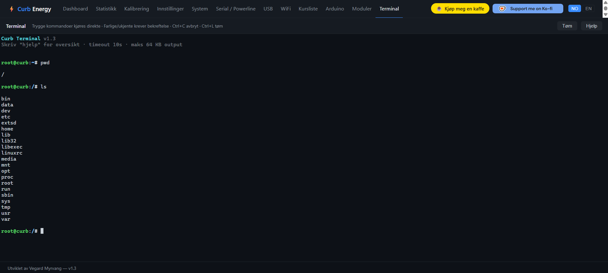
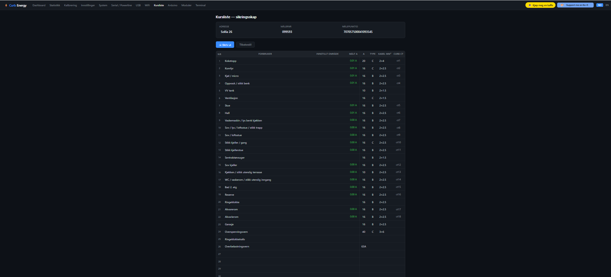
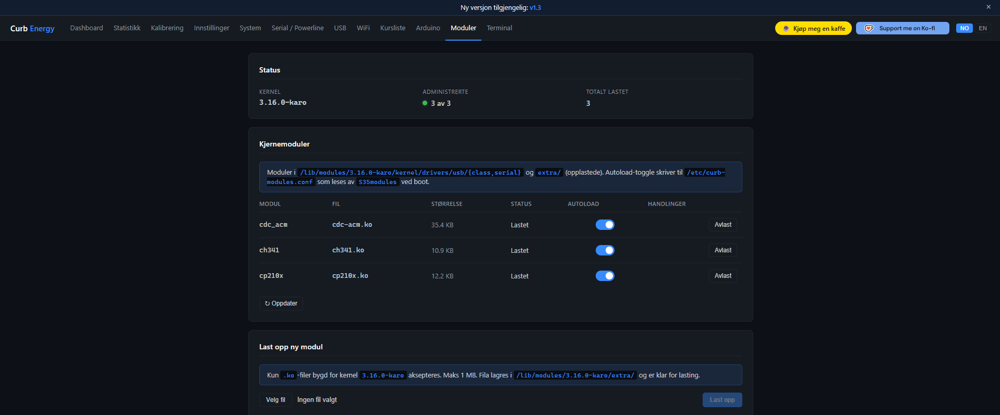
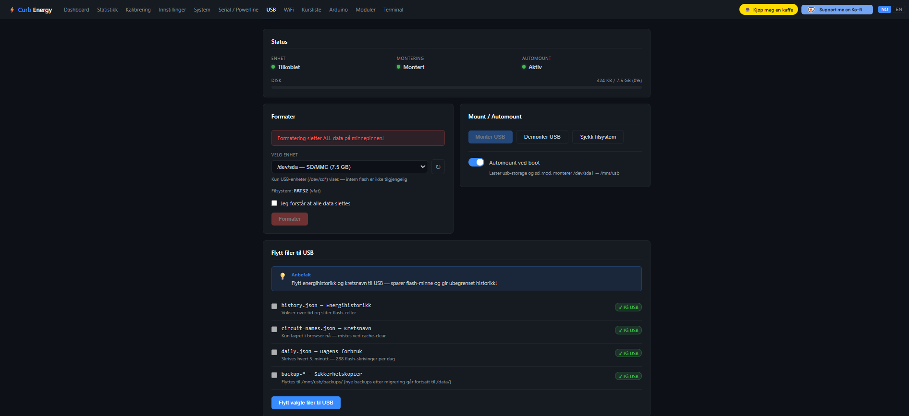
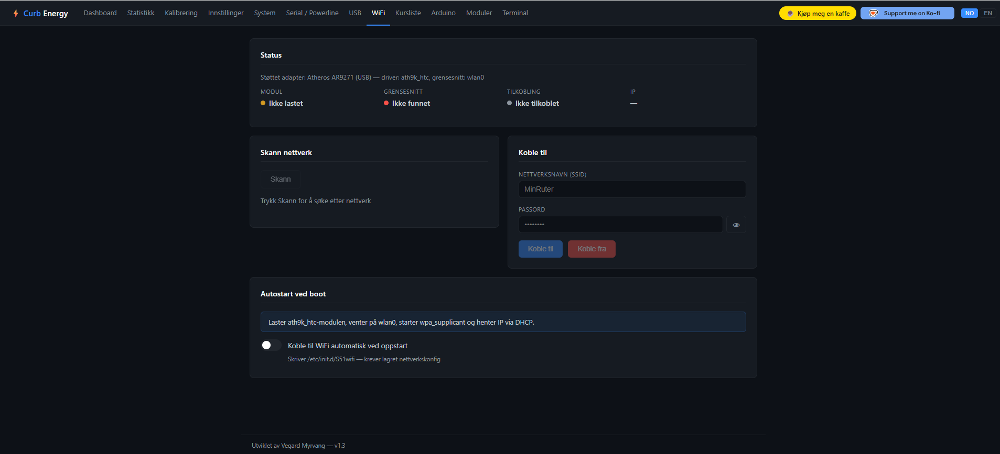

# Curb Energy Monitor — Local web interface

Replaces the Curb cloud dependency with a fully local web interface and direct MQTT publishing to Home Assistant. No cloud account needed — everything runs on the device.

[](https://buymeacoffee.com/vegardm)
[](https://ko-fi.com/D1D61JYEPS)
[](LICENSE)



> **Disclaimer:** This project is an independent, community-made tool.
> It is not affiliated with, endorsed by, or supported by Curb (efergy Technologies, LLC) in any way.
> Use at your own risk. Modifying your Curb device may void your warranty.

---

## What's new in v2.0

| Feature | Page |
|---------|------|
| **Web terminal** — full SSH-like terminal in the browser, Tab-completion, command history | `cli.html` |
| **Arduino / Serial monitor** — live serial output from Arduino/ESP32 over USB | `arduino.html` |
| **Live measurement list** — per-circuit W/A/V/PF table with one-click PDF print | `kursliste.html` |
| **Kernel module manager** — load/unload USB drivers, toggle boot persistence | `modules.html` |
| **USB file manager** — browse, upload, download and manage files on `/data/sd/` | `usb.html` |
| **WiFi configuration** — scan for networks and connect from the browser | `wifi.html` |
| **Pre-compiled USB drivers** — cdc-acm, ch341, cp210x for Linux 3.16.0-karo | `modules/bin/` |
| **Serial reader** — multi-device USB serial reader managed by hm | `serial-reader.lua` |

---

## Screenshots


*Dashboard — live power per circuit, grouped by CT, with distribution chart*


*Statistics — daily kWh per circuit as donut charts, hourly bar chart, period selector (day/week/month/year)*


*Calibration — per-circuit scale factors, live A readings, 0A reset*


*Settings — MQTT broker, credentials and device name*


*System info — device info, storage, memory, CPU load, network interfaces, PLC link quality*


*Serial & Powerline guide — J6 connector pinout, USB-serial wiring, PLC bridge instructions*


*Arduino / Serial monitor — live data from Arduino Mega over USB, temperature sensors and current per circuit*


*Web terminal — run commands directly on the Curb device from the browser*


*Live measurement list — per-circuit table with address, meter number and live A readings, PDF print*


*Kernel module manager — load/unload USB drivers, autoload toggle for boot persistence*


*USB file manager — storage status, format, mount/unmount and file transfer*


*WiFi configuration — scan for networks, connect/disconnect, autostart at boot*

---

## What this does

| Before | After |
|--------|-------|
| Curb → Curb Cloud → curb-to-mqtt.py → MQTT | Curb → MQTT direct |
| Web interface via Curb Cloud | Web interface local on device |
| Calibration in cloud config | Calibration via browser |
| MQTT config hardcoded in Python | MQTT config via browser |
| No local energy statistics | Daily kWh accumulation on device, historical archive |

## Requirements

- Curb Energy Monitor (NXP i.MX28, Linux 3.16.0, LuaJIT 2.0.4)
- SSH access to `root@<curb-ip>` (password or SSH key)
- MQTT broker on the network (e.g. Mosquitto on Home Assistant)
- **Git Bash** on Windows (not CMD or PowerShell) — [download Git for Windows](https://git-scm.com/download/win)

> **Based on:** [codearranger/curbed](https://github.com/codearranger/curbed/tree/main) —
> reverse-engineered documentation of the Curb IPC queue protocol, sampler data format, and Lua environment.

## ⚡ Before running install.sh — set up SSH

`install.sh` connects to Curb ~10 times. Without setup you will be prompted for the password 10 times.
**Already have an SSH key set up?** Leave the password blank when prompted — `install.sh` will use your existing key automatically.
Choose one of these options first:

---

### Option A — SSH key (recommended, free, one-time setup)

```bash
# Run once from Git Bash
ssh-keygen -t ed25519 -f ~/.ssh/curb_key -N ""
ssh-copy-id -i ~/.ssh/curb_key.pub root@<curb-ip>
```

After this: `bash install.sh` — no password prompt at all.
If you already have a key on the device, skip this step and just leave the password blank when `install.sh` asks.

---

### Option B — sshpass (password stored in memory, one prompt)

1. Download `sshpass.exe` from https://github.com/diyism/sshpass-for-windows/releases
2. Place the file in `C:\Program Files\Git\usr\bin\`
3. Verify: `command -v sshpass` should return a path

After this: `bash install.sh` — prompts for password once at the top, reused automatically.

---

### Option C — no setup

`bash install.sh` works, but you will type the password ~10 times.

---

## Installation

```bash
git clone https://github.com/vegard1977/curb-local
cd curb-local
bash install.sh              # Prompts for IP interactively
bash install.sh <curb-ip>    # Or give IP as argument
```

The script will:
1. **Create a backup** of all files it modifies (saved on the device under `/data/backup-<date>/`)
2. Upload Lua scripts to `/data/lamarr/`
3. Deploy web pages to `/data/sd/www/` (persistent) and `/tmp/www/` (live)
4. Prompt for MQTT credentials if `mqtt-config.json` is missing
5. Patch `/etc/hm.conf` with new process entries
6. Patch `/usr/local/bin/curb_status.sh` so web pages survive reboots

A log file (`install-YYYYMMDD-HHMMSS.log`) is written to the project folder for debugging.

## MQTT config

Copy the template and fill in your values — **never commit mqtt-config.json** (it is in `.gitignore`):

```bash
cp mqtt-config.json.example mqtt-config.json
# Edit mqtt-config.json with your values
```

Alternatively: edit directly in the browser via `http://<curb-ip>/settings.html`.

## Web interface

| Page | URL | Description |
|------|-----|-------------|
| Dashboard | `http://<curb-ip>/energy.html` | Live power per circuit, W/A/V/PF, group totals |
| Statistics | `http://<curb-ip>/stats.html` | Daily kWh donut charts + hourly bar chart, period selector |
| Calibration | `http://<curb-ip>/calibration.html` | Scale factors, live readings, 0A reset |
| Settings | `http://<curb-ip>/settings.html` | MQTT broker, credentials, device name, file upload |
| System | `http://<curb-ip>/sysinfo.html` | Uptime, memory, storage, network, PLC link quality |
| Serial / Powerline | `http://<curb-ip>/serial-guide.html` | J6 pinout, USB-serial wiring, PLC bridge guide |
| Arduino / Serial | `http://<curb-ip>/arduino.html` | Live serial monitor for Arduino/ESP32, send commands |
| Web terminal | `http://<curb-ip>/cli.html` | Full terminal in browser — Tab-completion, command history |
| Live measurements | `http://<curb-ip>/kursliste.html` | Per-circuit W/A/V/PF table with PDF print |
| Kernel modules | `http://<curb-ip>/modules.html` | Load/unload USB drivers from browser |
| USB files | `http://<curb-ip>/usb.html` | Browse, upload, download and manage files on `/data/sd/` |
| WiFi | `http://<curb-ip>/wifi.html` | Scan and connect to WiFi networks |

### Dashboard
Live power consumption per circuit — updated every second. Shows W, A, V, PF and totals per CT group.
Pie chart shows power distribution across the three CT groups.

### Statistics
Energy statistics accumulated continuously on the device — independent of whether a browser is open.
- **Donut charts** — kWh per circuit for each of the three CT groups
- **Hourly bar chart** — kWh per hour for the current day (24 bars)
- **Period selector** — switch pie charts between Day / Week / Month / Year using `history.json`
- Resets automatically at midnight; historical data survives reboots

### Calibration
Connect a known reference measuring device (e.g. Fluke) to a circuit and press **Calculate**
— a new scale factor is computed automatically. All 18 CTs are shown with live values.
Supports 0A calibration (mute a circuit with no load).

### Settings
MQTT broker, username, password, base topic and device name — edit and save directly from the browser.
Changes take effect after mqtt-streamer restarts (automatic via hm).

**File upload** — drag-and-drop or click to upload files directly to the Curb device (no SSH needed):
- HTML pages and images → `/data/sd/www/` (active immediately, survives reboots)
- `mqtt-streamer.lua` or `api-server.lua` → `/data/lamarr/` (streamer auto-restarts)

### System info
- Device info: serial number, hardware version, OS version
- Storage bars for `/data` (configs, statistics) and `/data/sd` (web pages, logs)
- Memory usage bar and CPU load averages
- Network: IP address, per-interface state, MAC, RX/TX traffic, drop count
- Powerline (PLC): connected node MAC and TX/RX signal quality in dB
- Process status: sampler, streamer, api-server

### Serial / Powerline guide
Instructions for connecting a USB-serial adapter to the Curb **J6 debug port** —
useful for reading boot logs, debugging, or accessing the device without network.

Also covers the built-in **powerline (PLC) bridge**: the Curb uses a Qualcomm QCA7000
HomePlug AV chipset, so a compatible powerline ethernet adapter plugged into the same
electrical circuit gives wired LAN access without running new cables.

**J6 pinout** (2.54 mm pitch, 3.3 V logic — located on the main PCB):

| Pin | Signal |
|-----|--------|
| 1 | GND |
| 2 | TX (Curb → adapter) |
| 3 | RX (adapter → Curb) |
| 4–6 | NC |

Connect TX→RX and RX→TX on a **3.3 V** USB-serial adapter (CP2102, CH340, FTDI).
Baud rate: **115200**, 8N1. The serial console appears on `/dev/ttymxc1` on the device.

### Arduino / Serial monitor
Live serial output from any USB-connected Arduino, ESP32 or similar device.
`serial-reader.lua` manages all configured ports via `select()` for non-blocking parallel reads.
Configure ports and baud rates in `/data/serial-devices.json` (or via the web interface).

### Web terminal
Full SSH-like terminal in the browser — runs commands on the Curb device and streams output live.
Supports Tab-completion, command history (↑/↓), and ANSI colour. Useful for troubleshooting without
needing an SSH client.

### Live measurements
Sortable per-circuit table of live W/A/V/PF readings with group subtotals.
One-click PDF print generates a formatted measurement report — useful for documenting a circuit panel.

### Kernel module manager
Manage USB kernel drivers from the browser: load/unload modules and toggle boot persistence.
Pre-compiled drivers for Linux 3.16.0-karo are included in `modules/bin/`:
cdc-acm, ch341, cp210x, usbserial (supports Arduino Uno/Mega, ESP32, CH340 clones).

### USB file manager
Browse, upload, download, rename and delete files on `/data/sd/`. Also supports formatting
the USB partition and moving files between directories — useful for managing web pages,
logs and config files without SSH.

### WiFi configuration
Scan for nearby access points and connect/disconnect from the browser.
Shows signal strength (dBm), current connection status and assigned IP.

---

## Architecture

```
[ADE7816 chip]
     |
[sampler.lua]  <-- managed by hm (health monitor), writes to IPC queue
     |
     +-- queue 1234 (STREAMER) --> [original streamer.lua]
     +-- queue 5678 (LEGACY)  --> [mqtt-streamer.lua]
                                      |
                                      +-- MQTT publish --> broker --> Home Assistant
                                      +-- /tmp/www/latest.json  --> Dashboard
                                      +-- /tmp/www/daily.json   --> Statistics (today)
                                      +-- /tmp/www/history.json --> Statistics (history)
                                      +-- /tmp/www/sysinfo.json --> System info (10 s)
                                      |
                               [api-server.lua] (port 8080)
                                      |
                                      +-- GET /api/data           --> latest.json
                                      +-- GET/POST /api/calibration
                                      +-- GET/POST /api/mqtt
```

### Files on the Curb device

| File | Description |
|------|-------------|
| `/data/lamarr/mqtt-streamer.lua` | MQTT publishing, kWh accumulation, sysinfo writer |
| `/data/lamarr/api-server.lua` | REST API for web interface (port 8080) |
| `/data/lamarr/serial-reader.lua` | Multi-device USB serial reader |
| `/data/calibration.json` | ADE7816 scale factors (editable via browser) |
| `/data/mqtt-config.json` | MQTT credentials (chmod 600, never in git) |
| `/data/serial-devices.json` | Serial port config for serial-reader.lua |
| `/data/daily.json` | Today's kWh per circuit + hourly totals (survives reboots) |
| `/data/history.json` | Per-circuit kWh archive, one entry per day, max 365 days |
| `/data/sd/www/` | Persistent storage of web pages and images |
| `/tmp/www/` | Active web root (lighttpd, populated from `/data/sd/www/` on boot) |
| `/tmp/www/sysinfo.json` | System stats written every 10 s by mqtt-streamer |
| `/lib/modules/3.16.0-karo/kernel/drivers/usb/*/` | USB kernel drivers (cdc-acm, ch341, cp210x…) |
| `/etc/init.d/S35modules` | Boot init script — loads modules listed in curb-modules.conf |
| `/etc/curb-modules.conf` | List of `.ko` paths to load at boot (managed by modules.html) |

## Backup and restore

`install.sh` automatically creates a backup in `/data/backup-<date>/` on the device.

### Restore manually

```bash
ssh root@<curb-ip>

# List backups
ls /data/backup-*/

# Restore a file
cp /data/backup-<date>/hm.conf /etc/hm.conf

# Stop new processes and let hm clean up
kill $(ps | grep mqtt-streamer | grep lua | sed 's/^ *//' | cut -d' ' -f1) 2>/dev/null
kill $(ps | grep api-server    | grep lua | sed 's/^ *//' | cut -d' ' -f1) 2>/dev/null
```

### Files modified by install.sh

| File | Change |
|------|--------|
| `/etc/hm.conf` | Adds `mqtt streamer`, `api server` and `serial reader` process entries |
| `/usr/local/bin/curb_status.sh` | Copies all 12 HTML pages + images on each boot |
| `/data/lamarr/mqtt-streamer.lua` | New file (replaces curb-to-mqtt.py) |
| `/data/lamarr/api-server.lua` | New file |
| `/data/lamarr/serial-reader.lua` | New file |
| `/data/calibration.json` | Only if absent |
| `/data/mqtt-config.json` | Only if absent |
| `/data/serial-devices.json` | Only if absent (uploaded from example) |

## Home Assistant auto-discovery

`mqtt-streamer.lua` sends 72 MQTT retained discovery messages on startup
(18 circuits × 4 sensors: W, A, PF, V). Devices appear automatically in HA
under **Settings → Devices & Services → MQTT**.

Discovery topic format:
```
homeassistant/sensor/curb_<serial>/curb_<serial>_circuit_N/config
```

## Calibration

The ADE7816 chip has all VGAIN/IGAIN/WGAIN registers set to 0 in firmware.
All calibration is done in software via `/data/calibration.json`:

- `volt_scale` — voltage: measure reference / raw ADC value
- `watt_scale` — power: calibrate against a known load
- `pf_scale` — 1/32768 (Q15 format, constant)
- `circuit_current_scales[n]` — individual CT calibration per circuit

## Credits

This project would not have been possible without the reverse engineering work done by
[codearranger/curbed](https://github.com/codearranger/curbed/tree/main), which documented
the Curb internal IPC queue protocol, sampler data format, and Lua runtime environment.

## License

MIT
