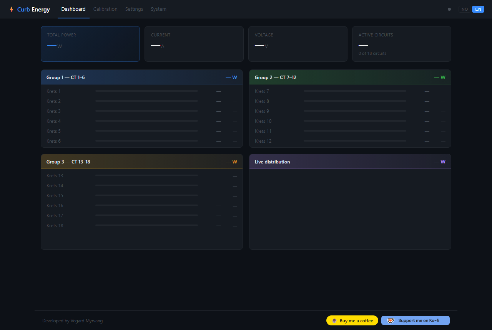
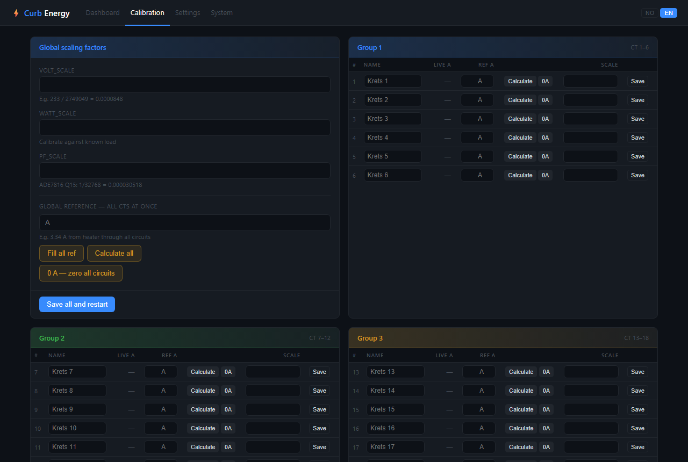
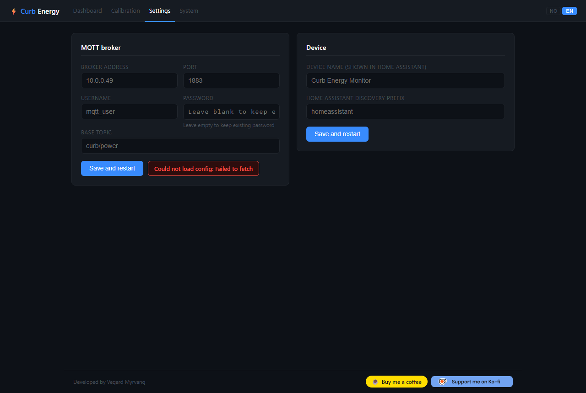
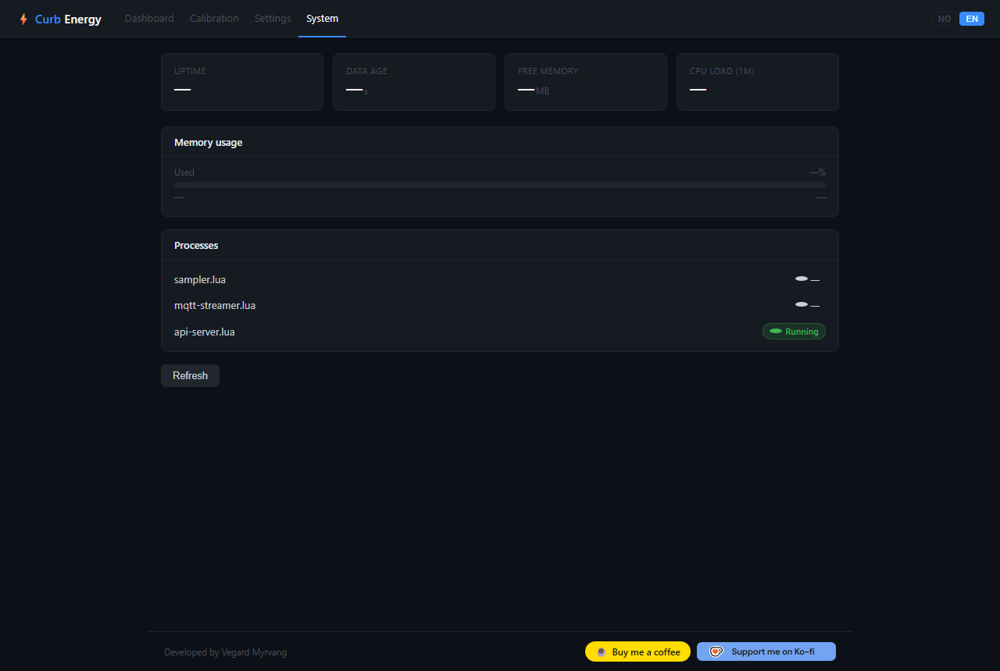

# Curb Energy Monitor — Local web interface

Replaces the Curb cloud dependency with a fully local web interface and direct MQTT publishing to Home Assistant.

[](https://buymeacoffee.com/vegardm)
[](https://ko-fi.com/D1D61JYEPS)

> **Disclaimer:** This project is an independent, community-made tool.
> It is not affiliated with, endorsed by, or supported by Curb (efergy Technologies, LLC) in any way.
> Use at your own risk. Modifying your Curb device may void your warranty.

---

## Screenshots


*Dashboard — live power per circuit, grouped by CT, with distribution chart*


*Calibration — per-circuit scale factors, live A readings, 0A reset*


*Settings — MQTT broker, credentials and device name*


*System info — uptime, memory, CPU load, process status*

---

## What this does

| Before | After |
|--------|-------|
| Curb → Curb Cloud → curb-to-mqtt.py → MQTT | Curb → MQTT direct |
| Web interface via Curb Cloud | Web interface local on device |
| Calibration in cloud config | Calibration via browser |
| MQTT config hardcoded in Python | MQTT config via browser |

## Requirements

- Curb Energy Monitor (NXP i.MX28, Linux 3.16.0, LuaJIT 2.0.4)
- SSH access to `root@<curb-ip>` (password or SSH key)
- MQTT broker on the network (e.g. Mosquitto on Home Assistant)
- **Git Bash** on Windows (not CMD or PowerShell)

## ⚡ Before running install.sh — set up SSH

`install.sh` connects to Curb ~10 times. Without setup you will be prompted for the password 10 times.
Choose one of these options first:

---

### Option A — SSH key (recommended, free, one-time setup)

```bash
# Run once from Git Bash
ssh-keygen -t ed25519 -f ~/.ssh/curb_key -N ""
ssh-copy-id -i ~/.ssh/curb_key.pub root@10.0.0.107
```

After this: `bash install.sh` — no password prompt at all.

---

### Option B — sshpass (password stored in memory, one prompt)

1. Download `sshpass.exe` from https://github.com/diyism/sshpass-for-windows/releases
2. Place the file in `C:\Program Files\Git\usr\bin\`
3. Verify: `command -v sshpass` should return a path

After this: `bash install.sh` — prompts for password once at the top, reused automatically.

---

### Option C — no setup

`bash install.sh` works, but you will type the password ~10 times.

---

## Installation

```bash
git clone https://github.com/vegardm/curb-local
cd curb-local
bash install.sh              # Prompts for IP interactively
bash install.sh 10.0.0.107   # Or give IP as argument
```

The script will:
1. **Create a backup** of all files it modifies (saved on the device under `/data/backup-<date>/`)
2. Upload Lua scripts to `/data/lamarr/`
3. Deploy web pages to `/data/sd/www/` (persistent) and `/tmp/www/` (live)
4. Prompt for MQTT credentials if `mqtt-config.json` is missing
5. Patch `/etc/hm.conf` with new process entries
6. Patch `/usr/local/bin/curb_status.sh` so web pages survive reboots

A log file (`install-YYYYMMDD-HHMMSS.log`) is written to the project folder for debugging.

## MQTT config

Copy the template and fill in your values — **never commit mqtt-config.json** (it is in `.gitignore`):

```bash
cp mqtt-config.json.example mqtt-config.json
# Edit mqtt-config.json with your values
```

Alternatively: edit directly in the browser via `http://<curb-ip>/settings.html`.

## Web interface

| Page | URL |
|------|-----|
| Dashboard | `http://<curb-ip>/energy.html` |
| Calibration | `http://<curb-ip>/calibration.html` |
| Settings | `http://<curb-ip>/settings.html` |
| System info | `http://<curb-ip>/sysinfo.html` |

### Dashboard
Live power consumption per circuit — updated every second. Shows W, A, V, PF and totals per CT group.
Pie chart shows power distribution across the three CT groups.

### Calibration
Connect a known reference measuring device (e.g. Fluke) to a circuit and press **Calculate**
— a new scale factor is computed automatically. All 18 CTs are shown with live values.
Supports 0A calibration (mute a circuit with no load).

### Settings
MQTT broker, username, password, base topic and device name — edit and save directly from the browser.
Changes take effect after mqtt-streamer restarts (automatic via hm).

### System info
Live view of uptime, memory usage, CPU load, data age and process status (sampler, streamer, api-server).

## Architecture

```
[ADE7816 chip]
     |
[sampler.lua]  <-- managed by hm (health monitor), writes to IPC queue
     |
     +-- queue 1234 (STREAMER) --> [original streamer.lua]
     +-- queue 5678 (LEGACY)  --> [mqtt-streamer.lua]
                                      |
                                      +-- MQTT publish --> broker --> Home Assistant
                                      +-- /tmp/www/latest.json --> web interface
                                      |
                               [api-server.lua] (port 8080)
                                      |
                                      +-- GET /api/data           --> latest.json
                                      +-- GET/POST /api/calibration
                                      +-- GET/POST /api/mqtt
                                      +-- GET /api/status
```

### Files on the Curb device

| File | Description |
|------|-------------|
| `/data/lamarr/mqtt-streamer.lua` | MQTT publishing + HA auto-discovery |
| `/data/lamarr/api-server.lua` | REST API for web interface (port 8080) |
| `/data/calibration.json` | ADE7816 scale factors (editable via browser) |
| `/data/mqtt-config.json` | MQTT credentials (chmod 600, never in git) |
| `/data/sd/www/` | Persistent storage of web pages |
| `/tmp/www/` | Active web root (lighttpd, cleared on reboot) |

## Backup and restore

`install.sh` automatically creates a backup in `/data/backup-<date>/` on the device.

### Restore manually

```bash
ssh root@<curb-ip>

# List backups
ls /data/backup-*/

# Restore a file
cp /data/backup-<date>/hm.conf /etc/hm.conf

# Stop new processes and let hm clean up
kill $(ps | grep mqtt-streamer | grep lua | sed 's/^ *//' | cut -d' ' -f1) 2>/dev/null
kill $(ps | grep api-server    | grep lua | sed 's/^ *//' | cut -d' ' -f1) 2>/dev/null
```

### Files modified by install.sh

| File | Change |
|------|--------|
| `/etc/hm.conf` | Adds `mqtt streamer` and `api server` process entries |
| `/usr/local/bin/curb_status.sh` | Adds HTML file copying to `/tmp/www/` |
| `/data/lamarr/mqtt-streamer.lua` | New file (replaces curb-to-mqtt.py) |
| `/data/lamarr/api-server.lua` | New file |
| `/data/calibration.json` | Only if absent |
| `/data/mqtt-config.json` | Only if absent |

## Home Assistant auto-discovery

`mqtt-streamer.lua` sends 72 MQTT retained discovery messages on startup
(18 circuits × 4 sensors: W, A, PF, V). Devices appear automatically in HA
under **Settings → Devices & Services → MQTT**.

Discovery topic format:
```
homeassistant/sensor/curb_<serial>/curb_<serial>_circuit_N/config
```

## Calibration

The ADE7816 chip has all VGAIN/IGAIN/WGAIN registers set to 0 in firmware.
All calibration is done in software via `/data/calibration.json`:

- `volt_scale` — voltage: measure reference / raw ADC value
- `watt_scale` — power: calibrate against a known load
- `pf_scale` — 1/32768 (Q15 format, constant)
- `circuit_current_scales[n]` — individual CT calibration per circuit

## Credits

This project would not have been possible without the reverse engineering work done by
[codearranger/curbed](https://github.com/codearranger/curbed/tree/main), which documented
the Curb internal IPC queue protocol, sampler data format, and Lua runtime environment.

## License

MIT
